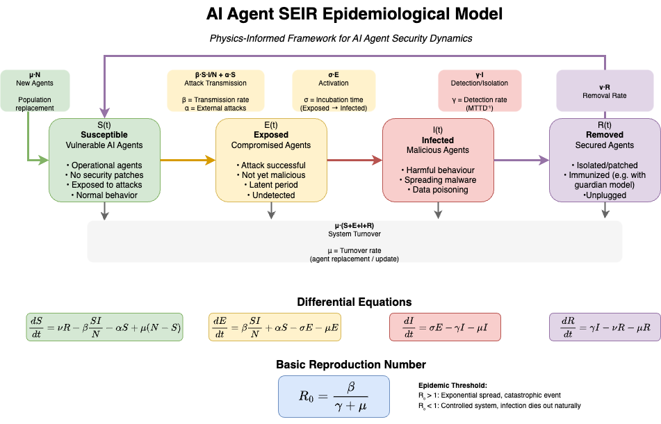

# Assessing and Managing AI Agentic System Vulnerability via Epidemiological Dynamics and Physics-Informed Neural Networks

Research conducted at the AI Safety x Physics Grand Challenge, 2025. [Project Link](https://apartresearch.com/project/ai-agentic-system-epidemiology-b83r)

## Overview

Language‑based AI agents are increasingly deployed across domains, from customer support to autonomous trading agents. However, the agents can be compromised by adversarial inputs (e.g., prompt injections), propagate misinformation learned from uncurated data, or miscommunicate in multi-agent settings. This project demonstrates how Physics-Informed Neural Networks (PINNs) can help evaluate and manage systemic risks for large-scale AI agent deployments.

To analyze the propagation of adversarial behavior in large AI agent populations, we use a Susceptible‑Exposed‑Infectious‑Removed (SEIR) compartmental model from epidemiology. Agents transition between states according to interactions with peers, external adversaries, and intervention policies. We then apply PINNs to approximate the solution trajectories of the governing ordinary differential equations (ODEs), leveraging known physical structure while accommodating complex, nonlinear dynamics.